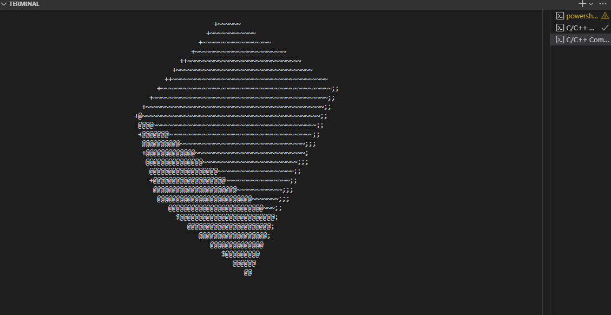

  <strong>Mi pedazo de demo</strong> 
  

## Roating Cube
This is a 3D rotating cube with ASCII in the middle of 2025, inspired by videos like "Code Fiction", yes, from 3 years ago, with some kids, I decided to use C, because it's better than Python in the first place, but anyway, this shitty cube took a few hours to develop, here are the sources of inspiration:
> https://www.youtube.com/watch?v=p09i_hoFdd0
> 
> https://www.youtube.com/watch?v=VzGw7CiEiJY&t=13s
> 
> https://www.youtube.com/watch?v=BabnK-BzGPo (skid)
> 
> https://www.youtube.com/watch?v=E1SmvtTr-Xw

It's all been inspiration. In case you don't believe me, you can check out the fucking code and shut up. This code for the spinning cube contains:
- Use rotations with sines and cosines about the axes
- Apply perspective projection: divide by depth (ooz = 1/z) to simulate how objects get smaller as they move away
- It uses a z-buffer to control which pixels are in front and which are in back, i.e., it implements a mini-renderer

And nothing else.
